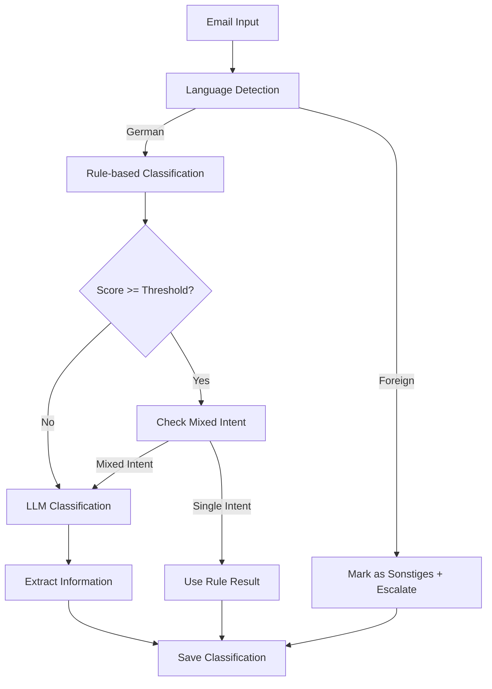

# Email Classification System

## Overview

The email classification system uses a hybrid approach combining fast rule-based classification with LLM-powered validation and extraction. This ensures both speed and accuracy while minimizing resource usage.

## Architecture

### Components

1. **Rule-based Classifier** (`src/ai/classification/rules.ts`)
   - Keyword and regex pattern matching
   - Heuristic scoring (0.0 - 1.0)
   - Language detection
   - Mixed intent detection

2. **LLM Classifier** (`src/ai/classification/llm.ts`)
   - OLLAMA integration for local deployment
   - Cloud provider stubs for development
   - Structured JSON output with extraction
   - Detailed confidence scoring

3. **Hybrid Pipeline** (`src/pipeline/decide/classify.ts`)
   - Combines both approaches intelligently
   - Fast path for high-confidence rule matches
   - LLM fallback for complex cases
   - Automatic escalation handling

## Classification Categories

### Input Categories (Rules)
- **Termin**: Appointment requests
- **Terminabsage**: Appointment cancellations/changes
- **AU**: Sick note requests (Arbeitsunfähigkeit)
- **Rezept**: Prescription requests
- **Allgemeine Frage**: General medical questions
- **Sonstiges**: Everything else

### Final Categories (LLM/Output)
- **Termin vereinbaren**: Book appointment
- **Termin absagen/ändern**: Cancel/change appointment
- **Frage zu Krankschreibung**: Sick note questions
- **Frage zu Rezept**: Prescription questions
- **Allgemeine Frage**: General questions
- **Sonstiges**: Other

## Classification Flow



## Configuration

### Settings

Configure via `SettingsRepo`:

```typescript
{
  classification: {
    score_gate_threshold: 0.7  // Minimum score for rule-based fast path
  }
}
```

### Environment Variables

```bash
# LLM Provider
LLM_PROVIDER=ollama  # Options: ollama, openai, anthropic, cloud

# OLLAMA Configuration
OLLAMA_BASE_URL=http://localhost:11434
OLLAMA_MODEL=llama2
OLLAMA_TIMEOUT=30000
```

## Extraction Fields

Each category extracts specific information:

### Termin vereinbaren
- `desired_date`: YYYY-MM-DD format
- `desired_time`: Time or period (e.g., "vormittags", "14:00")
- `urgency`: normal/dringend/notfall
- `reason`: Brief reason for appointment

### Termin absagen/ändern
- `appointment_date`: Original date
- `appointment_time`: Original time
- `action`: absagen/verschieben
- `new_date`: New date (if rescheduling)
- `new_time`: New time (if rescheduling)

### Frage zu Krankschreibung
- `au_since`: Start date (YYYY-MM-DD)
- `au_duration`: Duration in days
- `au_type`: erstbescheinigung/folgebescheinigung
- `diagnosis`: Mentioned symptoms/diagnosis

### Frage zu Rezept
- `medication`: Medication name(s)
- `dosage`: Dosage information
- `quantity`: Amount/package size
- `prescription_type`: neu/folgerezept

### Allgemeine Frage
- `topic`: Main topic
- `symptoms`: Mentioned symptoms
- `duration`: Duration of complaints

### Sonstiges
- `reason`: Why classified as other

## Flags and Escalation

The system sets various flags to indicate special handling:

```typescript
{
  mixed_intent: boolean,     // Multiple topics in one email
  foreign_language: boolean, // Non-German content
  unclear: boolean,         // Content is unclear/ambiguous
  escalate: boolean        // Requires manual review
}
```

### Escalation Triggers

Emails are escalated when:
1. Foreign language detected → Always escalated
2. Mixed intents detected → Always escalated
3. LLM confidence < 0.5 → Escalated for review
4. LLM unavailable/failed → Escalated with rule result
5. Classification errors → Escalated as "Sonstiges"

## Error Handling

### Graceful Degradation

1. **LLM Unavailable**: Falls back to rule-based result with escalation flag
2. **Invalid LLM Response**: Uses rule result, marks as unclear
3. **JSON Parsing Error**: Treats as LLM failure, uses rules
4. **Missing Email**: Returns "Sonstiges" with error flag

### Strict JSON Validation

LLM responses must contain:
- Valid category from the allowed list
- Confidence between 0.0 and 1.0
- Extracted object (can be empty)
- All required flags as booleans

## Performance Considerations

### Optimization Strategies

1. **Fast Path**: ~70% of emails classified by rules without LLM
2. **Caching**: Prompt template cached in memory
3. **Timeouts**: Configurable LLM timeout (default 30s)
4. **Batch Processing**: Support for classifying multiple emails

### Expected Performance

- Rule classification: < 10ms per email
- LLM classification: 1-5s per email (depending on model)
- Hybrid average: ~300ms per email (with 70% rule coverage)

## Testing

### Test Coverage

The system includes comprehensive tests for:
- All classification categories
- Mixed intent scenarios
- Foreign language detection
- Error conditions
- Edge cases (empty content, special characters)

### Test Fixtures

10+ realistic email fixtures covering:
1. Simple appointment requests
2. Appointment cancellations
3. Sick note requests
4. Prescription requests
5. General questions
6. Mixed intents (2-3 topics)
7. Foreign language emails
8. Unclear/spam content
9. Complex multi-topic emails
10. Urgent medical questions

## Monitoring

### Metrics to Track

1. **Classification Distribution**: Count by category
2. **Method Usage**: Rules vs LLM ratio
3. **Escalation Rate**: Percentage requiring review
4. **Processing Time**: Average per email
5. **Error Rate**: Failed classifications

### Logging

All classification events are logged with:
- Email ID
- Category and confidence
- Method used (rules/llm)
- Flags set
- Processing time
- Any errors encountered

## Future Enhancements

1. **Model Fine-tuning**: Train specialized models for medical German
2. **Feedback Loop**: Learn from manual corrections
3. **Multi-language Support**: Extend beyond German/English detection
4. **Confidence Calibration**: Improve threshold tuning
5. **Extraction Enhancement**: More detailed information extraction
6. **Real-time Updates**: WebSocket notifications for escalations