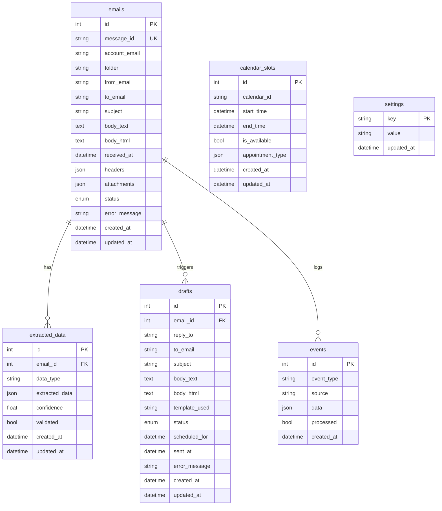
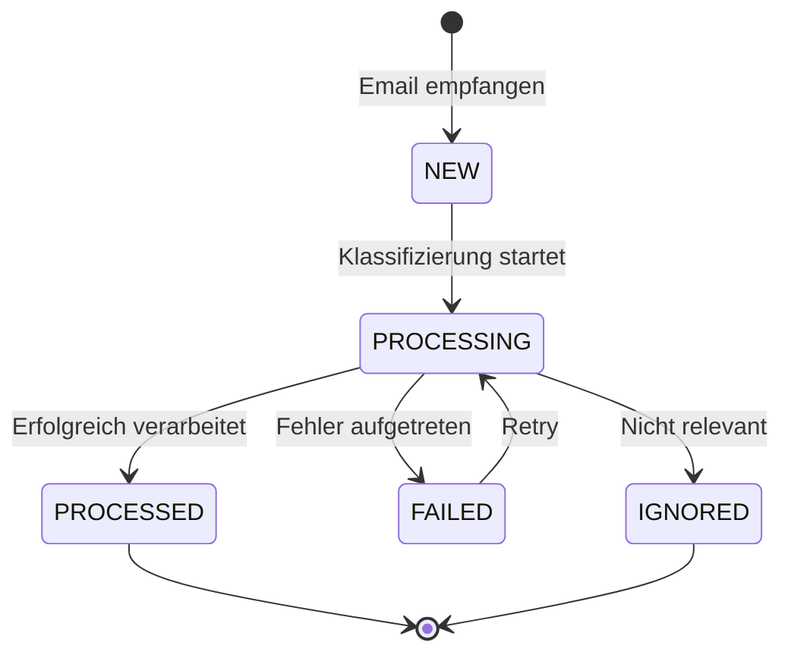
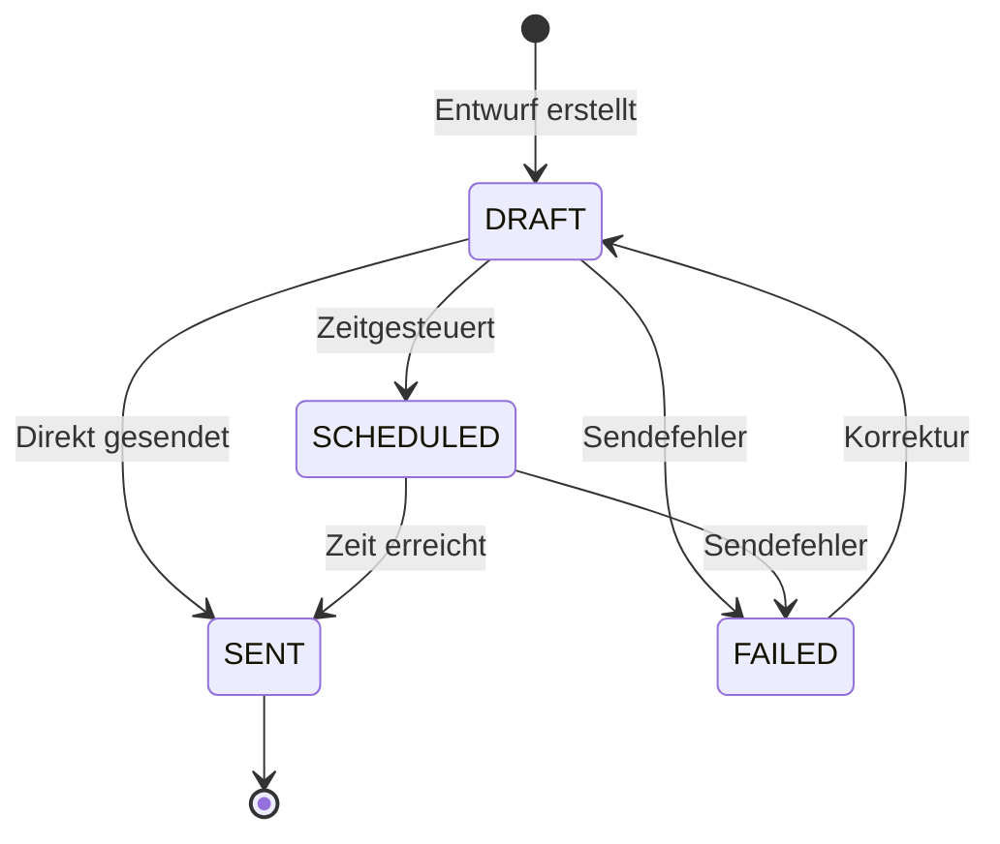

# DB & State Management

## Übersicht

Der Praxis E-Mail Agent nutzt SQLite mit better-sqlite3 für persistente Datenhaltung. Das System ist auf Idempotenz, Audit-Trails und klare State-Übergänge ausgelegt.

## Datenbank-Schema



## State-Flows

### E-Mail Verarbeitungs-Pipeline



### Draft Lifecycle



## Repository-Pattern

### EmailsRepo
- `insertIngested(email)`: Neue E-Mail hinzufügen
- `markClassified(id, class, score, flags)`: Klassifizierung speichern
- `addPIIFlags(id, json)`: PII-Markierungen hinzufügen
- `upsertState(id, state)`: Status aktualisieren
- `findByMessageId(msgId)`: Suche per Message-ID
- `findByTextHash(hash)`: Duplikat-Erkennung

### ExtractedRepo
- `upsert(email_id, fields, confidence)`: Daten extrahieren/aktualisieren
- `findByEmailId(email_id)`: Alle extrahierten Daten
- `validate(id)`: Daten als validiert markieren

### DraftsRepo
- `insert(email_id, class, template, body)`: Entwurf erstellen
- `updateStatus(id, status)`: Status ändern
- `schedule(id, datetime)`: Zeitgesteuert planen

### CalendarRepo
- `createSlot(slot)`: Zeitslot anlegen
- `hold(slotId, emailId, ttl)`: Temporär reservieren
- `confirm(slotId)`: Reservierung bestätigen
- `releaseExpiredHolds()`: Abgelaufene Holds freigeben

### EventsRepo
- `append(email_id, type, data)`: Event loggen
- `findByEmailId(email_id)`: Audit-Trail abrufen

### SettingsRepo
- `get/set(key, value)`: Key-Value Speicher
- Typed accessors für alle Einstellungen

## Idempotenz

### Text-Hashing
```typescript
// SHA256(messageId + normalizedBody)
const hash = createHash('sha256')
  .update(`${messageId}:${normalizedBody}`)
  .digest('hex');
```

### Duplikat-Erkennung
1. Check auf Message-ID (Primary)
2. Check auf Text-Hash (Secondary)
3. Batch-Deduplizierung im Speicher

## Audit & Events

Alle wichtigen Operationen werden geloggt:

```typescript
auditLogger.logEmailReceived(emailId, messageId, from);
auditLogger.logEmailClassified(emailId, classification, confidence);
auditLogger.logDraftCreated(emailId, draftId, template);
auditLogger.logDraftSent(emailId, draftId, to);
```

## Typed Settings

Zentrale Konfiguration mit Typ-Sicherheit:

```typescript
praxisSettings.autoSendEnabled = true;
praxisSettings.autoSendConfidenceThreshold = 0.95;
praxisSettings.workingHoursStart = "08:00";
praxisSettings.workingDays = [1, 2, 3, 4, 5]; // Mo-Fr

// Helper
if (praxisSettings.canAutoSend(confidence)) {
  // Auto-send logic
}
```

## Best Practices

1. **Transaktionen**: Nutze `dbConnection.transaction()` für atomare Operationen
2. **Idempotenz**: Prüfe immer auf Duplikate vor Insert
3. **Audit**: Logge alle state-changing Operations
4. **Error Handling**: Speichere Fehler in `error_message` Feldern
5. **Cleanup**: Nutze Events cleanup und Calendar hold expiry

## Performance

- WAL-Mode für bessere Concurrency
- Indizes auf: status, account_email, received_at, is_available
- Cache für häufig gelesene Settings
- Batch-Operationen wo möglich