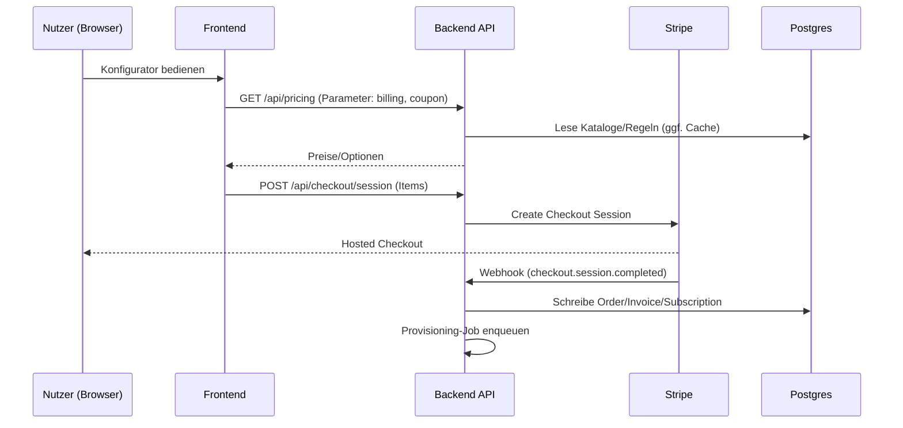

## C4: Komponenten (Backend) – German Code Zero AI

Scope: L3-Komponenten innerhalb des Backend-Containers (FastAPI). Fokus auf Services und Controller, die für Konfigurator, Checkout und Betriebsprozesse relevant sind.

### Hauptkomponenten
- **ModuleCatalog**
  - Liest Katalogdateien (`/config/*.catalog.json`) und stellt sie API-intern bereit.
  - Validiert Kompatibilität, Kategorien, Bundles.

- **PricingService**
  - Rechnet Live-Preise: Basispaket + Add-ons, Abo (mtl/6/12/24), One-Time, Coupons (z. B. Launch −50 %).
  - Nutzt Redis für kurzfristiges Caching; erfordert keine hinterlegten Beträge im Repo (nur Regeln/Metadaten).

- **CheckoutController**
  - Erstellt Stripe-Checkout-Sessions basierend auf konfigurierten Items und Laufzeit.
  - Persistiert Pending-`Order`/`OrderLineItem` in DB.

- **WebhookHandler (Stripe)**
  - Validiert Signatur; verarbeitet Events (checkout.session.completed, invoice.paid, customer.subscription.updated ...).
  - Aktualisiert `Order`, `Invoice`, `Subscription`; schreibt `WebhookEvent`-Audit-Trail; idempotent.

- **ProvisioningService**
  - Startet nach erfolgreicher Zahlung die Bereitstellung (z. B. Konten/Workspaces, Modulfreischaltung).
  - Läuft asynchron im Background Worker; robust gegen Wiederholungen.

- **ReferralService**
  - Erstellt/verifiziert Referral-Codes; ordnet Belohnungen nach Konversion zu.
  - Sichert gegen Missbrauch (Ratelimits, Fraud-Signale).

### Unterstützende Komponenten
- **OrderService**: CRUD/Statuswechsel für Orders und Positionen, Konsistenzregeln.
- **SubscriptionService**: Verwaltung von Laufzeiten, Verlängerungen, Kündigungen; Synchronisation mit Stripe.
- **CouponService**: Validierung von Coupons, Anwendungsregeln und Grenzen.
- **HealthController**: `/api/health` – Readiness/Liveness.

### Datenabhängigkeiten
- Postgres: `User`, `Company`, `Order`, `OrderLineItem`, `Plan`, `Module`, `AddOn`, `Coupon`, `Invoice`, `WebhookEvent`, `Referral`, `Subscription`.
- Redis: Caching (Pricing, Kataloge), Idempotency Keys, Ratelimits.

### Interaktionen (vereinfacht)

### Qualitätsattribute pro Komponente (Kurz)
- PricingService: p95 < 50 ms aus Cache, deterministisch, testbar mit Golden Files.
- WebhookHandler: strikt idempotent, Retry-safe, Audit-Logging.
- CheckoutController: Validiert Input/Kompatibilität, faile-fast, beobachtbar (Tracing/Spans).
- ProvisioningService: genau-einmal-Effekt logisch (mindestens-einmal technisch), kompensierende Aktionen.