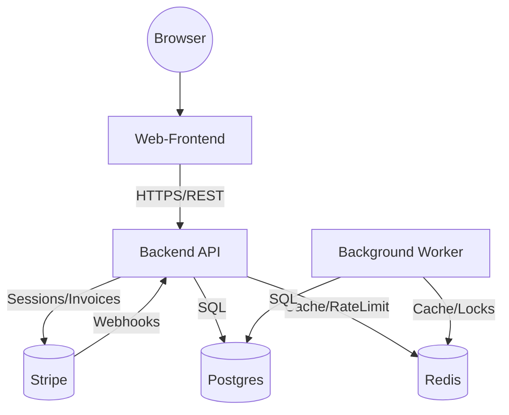

## C4: Container – German Code Zero AI

Scope: L2-Container-Ansicht der öffentlichen Plattform (Konfigurator + Checkout) mit Datenhaltung und externem Zahlungsdienst.

### Container
- **Browser (Kunde)**
  - Rendert Frontend, führt Interaktionen aus.
  - Ruft ausschließlich öffentliche Endpunkte des Frontends auf.

- **Web-Frontend (SSR/SPA)**
  - Präsentation (DE/EN), Konfigurator (Basis + Add-ons), SEO, Consent-Banner.
  - Spricht per HTTPS mit der Backend API.
  - Edge-/CDN-Caching für statische Assets, SEO-Metadaten.

- **Backend API (FastAPI)**
  - Verantwortlich für Pricing, Kataloge, Checkout, Webhooks, Orders, Referrals, Health.
  - Bietet REST-Endpoints; authentifiziert/autorisiert nutzerspezifische Aktionen.
  - Nutzt Postgres (Persistenz) und Redis (Cache/Ratelimits/Locks).

- **Background Worker**
  - Führt asynchrone Vorgänge aus: Provisioning, Rechnungsabgleich, E-Mail-Queues, Retrys.
  - Greift auf dieselbe DB/Redis zu; konsumiert interne Jobs (Queueing abstrakt dargestellt).

- **Postgres (Primary DB)**
  - Quelle der Wahrheit für User/Company/Orders/Subscriptions/Invoices/WebhookEvents/Referrals.
  - Point-in-Time-Recovery-fähige Backups.

- **Redis (Cache/Coordination)**
  - Response-Caching, Ratelimits, Idempotency Keys, kurzlebige Locks.

- **Stripe (Payment/Subscriptions)**
  - Checkout, Billing, Invoices, Webhooks.

### Container-Beziehungen

### Cross-Cutting Concerns
- **Security**: OAuth2/Bearer für API, CSRF-Schutz wo relevant, Webhook-Signaturprüfung, Secrets über KMS/Vault.
- **Observability**: Traces/Metrics/Logs (OpenTelemetry), Sentry-Fehlerberichte, strukturierte Logs.
- **CI/CD**: Build/Test/Lint, Infrastructure-as-Code getrennt (nicht Teil des öffentlichen Repos), Blue/Green/Canary optional.
- **Compliance**: Consent-Management, Datenschutzhinweise, DPIA-Prozess.