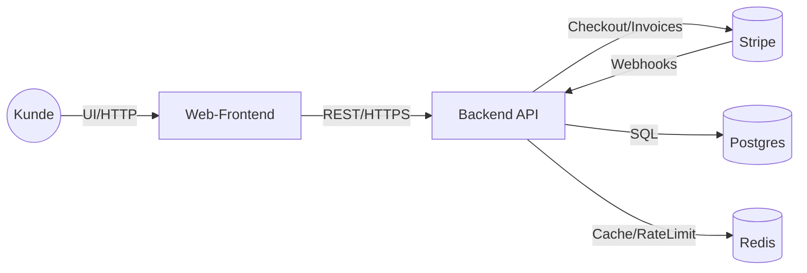

## C4: Kontext – German Code Zero AI (B2B)

Zweck: Überblick auf Ebene L1 (Kontext) für die B2B-Dienstleistungs-Website mit Konfigurator, Checkout und Abwicklung. Fokus auf Interaktionen: Kunde ↔ Frontend ↔ Backend ↔ Stripe ↔ Datenhaltung (Postgres/Redis).

### Akteure (People)
- **Kunde (Buyer/Decision Maker)**: Nutzt die Website, konfiguriert Leistungen (Basis + Add-ons), startet Checkout, erhält Rechnungen.
- **Kunde (Finance/Procurement)**: Prüft Preise/Verträge, führt Zahlung aus, verwaltet Abos.
- **Site Admin (Internal Ops)**: Überwacht Bestellungen, bearbeitet Incidents, managt Kataloge (nur via interne Admin-Oberfläche/API, nicht Teil des öffentlichen Angebots).

### Systeme (System Landscape)
- **Web-Frontend**: Öffentlich erreichbare Website (DE/EN) inkl. Konfigurator, SEO, Consent, Formularen.
- **Backend API**: FastAPI-basierter Dienst (REST), implementiert Pricing, Checkout, Webhooks, Provisioning, Referrals.
- **Zahlungsabwickler (Stripe)**: Checkout, Subscriptions, Invoicing, Webhooks.
- **Datenhaltung**: Postgres (Quelle der Wahrheit), Redis (Cache, Ratelimits, Idempotency).

### Beziehungen (High-Level Interactions)
- Kunde bedient das Frontend im Browser (SSR/SPA). Frontend ruft Backend-APIs auf.
- Backend erstellt Stripe-Checkout-Sessions; Stripe hostet den Bezahlvorgang und ruft Backend-Webhooks auf.
- Backend persistiert Bestellungen/Abos in Postgres, nutzt Redis für Caching und Nebenläufigkeit.

### Externe Schnittstellen
- **Stripe**: Checkout Sessions, Subscriptions, Invoices; Webhook-Events (z. B. checkout.session.completed).

### Nicht-funktionale Randbedingungen (Auszug)
- **Sicherheit**: TLS überall, Secrets über KMS/Vault, Webhook-Signaturen validieren, Least Privilege.
- **Leistung**: CWV-Budgets, p95 API < 300 ms (read), < 700 ms (write) unter Normallast.
- **Zuverlässigkeit**: Idempotente Webhooks, Outbox/Retry-Strategien, Backpressure via Queueing.
- **Compliance/Privacy**: Consent-Management, DPIA, zweckgebundene Speicherung, Löschkonzepte.

### Abgrenzung
- Keine Offenlegung von System-Interna außerhalb der hier beschriebenen öffentlichen Interaktionen.